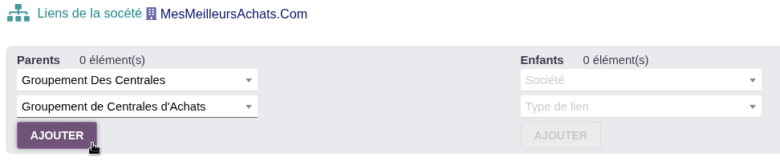
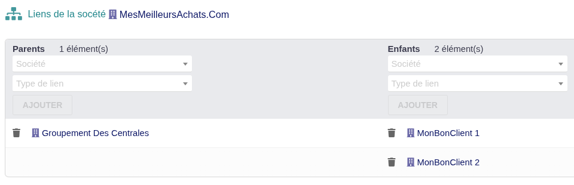
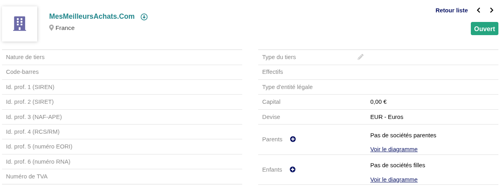
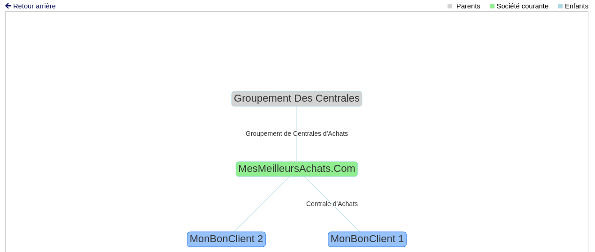
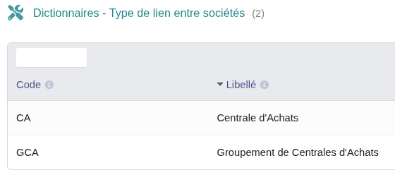
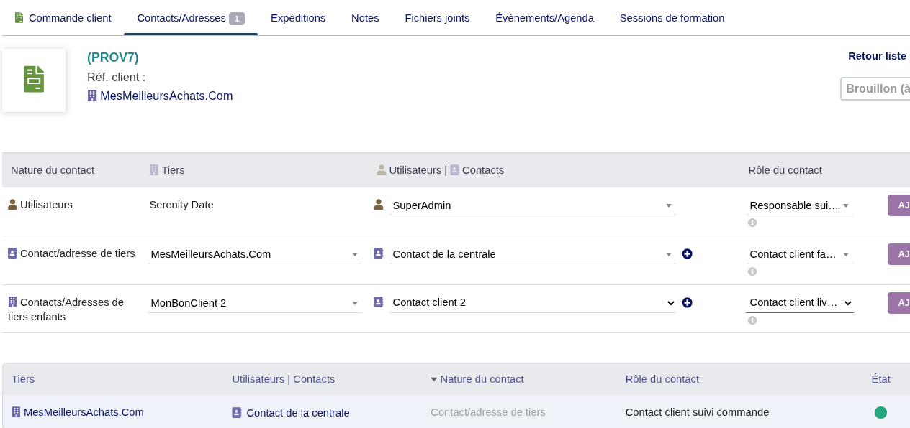
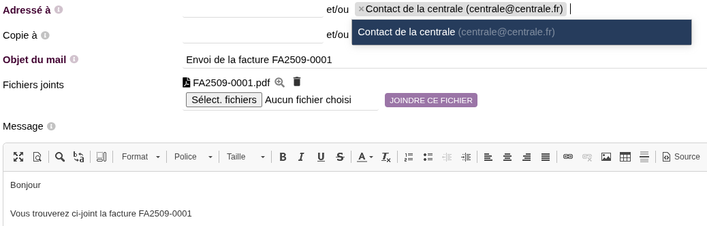
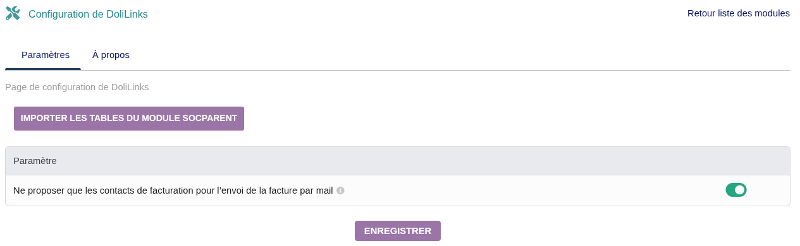

# DOLILINKS PER [DOLIBARR ERP & CRM](https://www.dolibarr.org)

## Descrizione del modulo

DoliLinks è un modulo per Dolibarr che consente di creare e gestire collegamenti gerarchici tra aziende (terze parti). Offre una visualizzazione chiara delle relazioni padre-figlio tra le aziende e facilita la gestione di strutture organizzative complesse.

## Funzionalità principali

### 1. Gestione dei collegamenti tra aziende

Il modulo consente di creare relazioni gerarchiche tra aziende:
- **Collegamenti padre-figlio**: Definire quali aziende sono genitori o figlie di altre aziende
- **Tipi di collegamento personalizzabili**: Creare tipi di collegamento specifici (filiale, succursale, partner, ecc.)
- **Prevenzione collegamenti circolari**: Il sistema impedisce di collegare un'azienda a se stessa

### 2. Visualizzazione gerarchica

#### 2.1 Visualizzazione nella scheda azienda
I collegamenti vengono visualizzati automaticamente nella scheda di ogni azienda:
- **Sezione Genitori**: Elenco delle aziende genitore con collegamenti diretti
- **Sezione Figlie**: Elenco delle aziende figlie con collegamenti diretti
- **Pulsanti di azione**: Aggiunta rapida di nuovi collegamenti e accesso al diagramma

#### 2.2 Diagramma interattivo
Visualizzazione grafica completa delle relazioni:
- **Rete gerarchica**: Visualizzazione di tutti i genitori, figli e nipoti
- **Navigazione interattiva**: Clic sui nodi per accedere alle schede azienda
- **Legenda colorata**: Distinzione visiva tra genitori (grigio), azienda corrente (verde) e figli (blu)
- **Tipi di collegamento**: Visualizzazione delle etichette dei tipi di collegamento sulle connessioni

### 3. Gestione dei tipi di collegamento

#### 3.1 Configurazione dei tipi
- **Creazione tipi personalizzati**: Definire tipi di relazione specifici per la propria organizzazione
- **Gestione centralizzata**: Interfaccia di amministrazione per creare e modificare i tipi
- **Dizionario integrato**: I tipi sono memorizzati nel dizionario di Dolibarr

### 4. Integrazione con l'ecosistema Dolibarr

#### 4.1 Hook ed estensioni
- **Integrazione nativa**: Il modulo si integra perfettamente nell'interfaccia di Dolibarr
- **Hook personalizzati**: Estensione delle funzionalità tramite il sistema di hook

#### 4.2 Filtro contatti di fatturazione
- **Filtro intelligente**: Opzione per offrire solo contatti di fatturazione durante l'invio di email (non inviare fatture ai clienti dei vostri clienti!!!)
- **Contatti terze parti figlie**: Visualizzazione dei contatti delle aziende collegate nelle schede contatto
- **Configurazione flessibile**: Attivazione/disattivazione tramite i parametri del modulo

#### 4.3 Compatibilità
- **Multi-entità**: Supporto completo della modalità multi-entità di Dolibarr
- **Sicurezza**: Rispetto dei diritti di accesso e della sicurezza di Dolibarr
- **Traduzioni**: Supporto multilingue (francese, inglese, tedesco, spagnolo, italiano)

### 5. Funzionalità avanzate

#### 5.1 Importazione dati
- **Migrazione da SocParent**: Strumento di importazione per migrare i dati dal modulo SocParent

#### 5.2 Report e statistiche
- **Contatori automatici**: Visualizzazione del numero di genitori/figli per ogni azienda
- **Navigazione facilitata**: Collegamenti diretti alle schede delle aziende collegate
- **Vista d'insieme**: Accesso rapido al diagramma completo delle relazioni

## Installazione

### Prerequisiti
- Dolibarr ERP & CRM installato
- Diritti di amministratore per l'installazione del modulo

### Installazione tramite interfaccia Dolibarr
1. Scaricare il modulo da [Dolistore.com](https://www.dolistore.com)
2. Connettersi a Dolibarr come amministratore
3. Andare in `Home > Configurazione > Moduli > Distribuisci modulo esterno`
4. Caricare il file ZIP del modulo
5. Attivare il modulo nella lista dei moduli disponibili

### Configurazione iniziale
1. Accedere a `Configurazione > Moduli > DoliLinks`
2. Configurare i parametri secondo le proprie esigenze
3. Creare i propri tipi di collegamento personalizzati se necessario

## Utilizzo

### Creare un collegamento tra aziende
1. Aprire la scheda dell'azienda interessata
2. Nella sezione "Genitori" o "Figlie", cliccare sul pulsante "+"
3. Selezionare l'azienda da collegare dall'elenco a discesa
4. Scegliere il tipo di collegamento (opzionale)
5. Cliccare su "Aggiungi"

### Visualizzare le relazioni
1. Dalla scheda azienda, cliccare su "Visualizza diagramma"
2. Il diagramma interattivo si visualizza con tutte le relazioni
3. Cliccare su qualsiasi nodo per accedere alla scheda dell'azienda

### Gestire i tipi di collegamento
1. Andare in `Configurazione > Dizionari > Tipo di collegamento tra aziende`
2. Creare, modificare o eliminare i tipi secondo le proprie esigenze

## Configurazione

### Parametri disponibili
- **Filtro contatti**: Opzione per offrire solo contatti di fatturazione durante l'invio di email

### Personalizzazione
Il modulo può essere esteso tramite:
- Hook personalizzati
- Template modificabili
- Classi PHP estensibili

## Supporto e sviluppo

### Licenza
- **Codice principale**: GPLv3 o versione successiva
- **Documentazione**: GFDL

### Supporto
- Documentazione completa nel modulo
- Compatibile con le versioni recenti di Dolibarr

### Sviluppo
Il modulo è sviluppato rispettando gli standard di Dolibarr:
- Architettura MVC
- Sistema di hook
- Gestione traduzioni
- Sicurezza integrata
